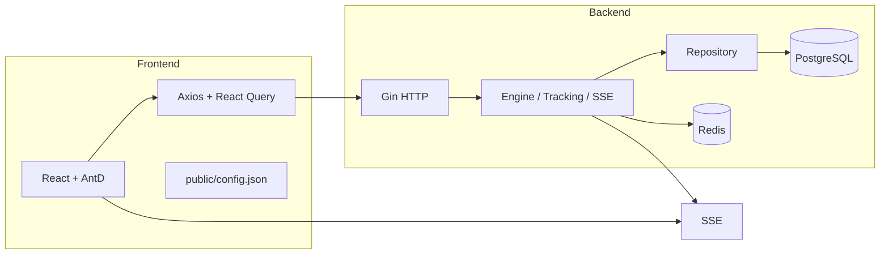
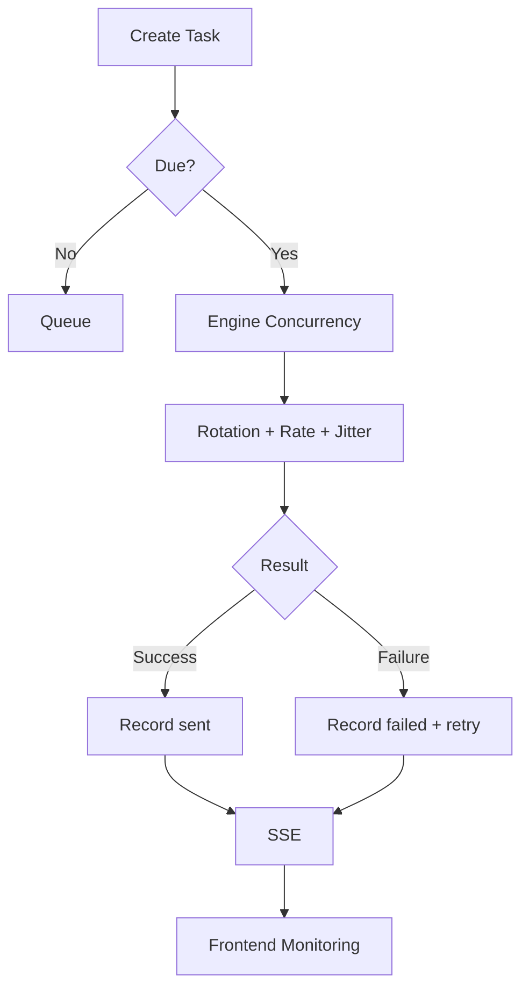

# Email Batch Service Platform

> Version: v0.1.0 · License: MIT · Author: Team Collaboration

English README is the primary documentation. For Simplified Chinese, please see `README.zh-CN.md`.



## 核心功能与交互
- 邮箱配置管理：增删改查、SMTP 参数加密存储
- 邮件发送引擎：并发控制、多账号轮换、频控随机抖动、最多 3 次重试、账号熔断
- 邮件模板管理：富文本编辑（React-Quill）与追踪开关
- 任务管理：创建、定时、队列执行，状态查询
- 实时监控：SSE 推送进度与失败高亮，一键重试
- 邮件追踪：像素追踪打开、链接点击追踪、统计接口



## 安装与部署
### System Requirements
- Node.js ≥ 18 (frontend)
- Golang ≥ 1.21 (backend)
- PostgreSQL ≥ 15
- Redis ≥ 7 (optional)
- Python 3.12 (optional)

### Clone & Install
```bash
git clone <repo>
cd email-batch-service

# Frontend
cd frontend && npm install

# Backend
cd ../backend && go mod tidy
```

### Configuration
- Backend config file: `backend/config/config.yaml`
  - Environment overrides via `EMAIL_*`, e.g.:
```bash
export EMAIL_DB_HOST=192.168.5.8
export EMAIL_DB_USER=user_S5YD4z
export EMAIL_DB_PASSWORD=password_bFkZC5
export EMAIL_DB_NAME=email_service
```
- Frontend runtime config: `frontend/public/config.json` (`baseURL`, `ssePath`, `chartRefreshMs`).

### Run
```bash
# Dev
cd backend && go run ./cmd/server
cd frontend && npm run dev

# Build
cd backend && go build -o server ./cmd/server
cd frontend && npm run build

# Docker (full)
docker-compose -f docker-compose.yml build
docker-compose -f docker-compose.yml up -d

# Docker (app only, DB/Redis already exist)
docker-compose -f docker-compose.app.yml build
docker-compose -f docker-compose.app.yml up -d

# Ensure external network exists
# docker network create 1panel-network
```

## API Examples
- Health:
```bash
curl http://localhost:8080/health
```
- Create email config:
```bash
curl -X POST http://localhost:8080/email-configs -H 'Content-Type: application/json' -d '{
  "provider":"gmail", "host":"smtp.gmail.com", "port":587,
  "username":"test@example.com", "password":"secret", "is_active":true
}'
```
- Create task:
```bash
curl -X POST http://localhost:8080/tasks -H 'Content-Type: application/json' -d '{
  "name":"campaign-1", "sender_configs":[1,2],
  "recipient_list":["a@ex.com","b@ex.com"], "template_id": 1
}'
```
- Subscribe SSE: `EventSource(`${baseURL}${ssePath}/${taskId}`)`.

## Contribution & Guidelines
- Follow SOLID; keep sensitive info secure; structured logging.
- Backend layering: handler/service/repository/model.
- Frontend: well-typed components; data via React Query.
- Semantic commits; PRs must pass tests & build.

## License
- MIT.

## Changelog
- v0.1.0: Initial release with engine, SSE, tracking, pages, runtime config, DB diagnostics & tests.
