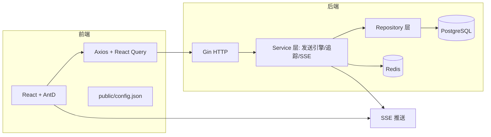
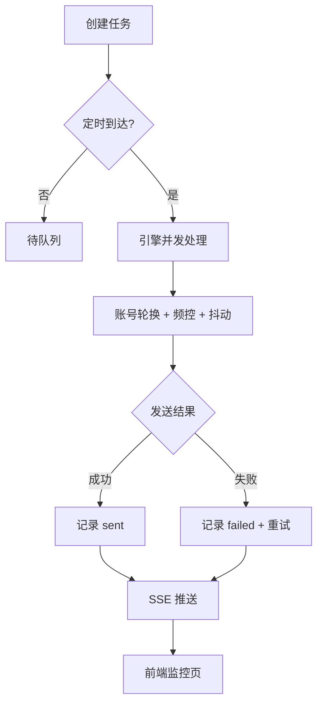

# 邮件批量发送服务平台

> 版本：v0.1.0  ·  许可证：MIT  ·  作者：团队协作

## 概述
- 本项目是基于 Golang（后端）与 React（前端）的批量邮件发送平台，支持多邮箱配置、并发发送、风控策略、任务管理、实时监控（SSE）与邮件追踪（像素与链接点击）。
- 后端使用 Gin + GORM + Viper，数据库推荐 PostgreSQL，缓存与队列可选 Redis。前端使用 React 18 + TypeScript + Vite，UI 使用 Ant Design，数据可视化使用 Chart.js。



## 核心功能与交互
- 邮箱配置管理：增删改查、SMTP 参数加密存储
- 邮件发送引擎：并发控制、多账号轮换、频控随机抖动、最多 3 次重试、账号熔断
- 邮件模板管理：富文本编辑（React-Quill）与追踪开关
- 任务管理：创建、定时、队列执行，状态查询
- 实时监控：SSE 推送进度与失败高亮，一键重试
- 邮件追踪：像素追踪打开、链接点击追踪、统计接口



## 安装与部署
### 系统要求
- Node.js ≥ 18（前端）
- Golang ≥ 1.21（后端）
- PostgreSQL ≥ 15
- Redis ≥ 7（可选）
- Python 3.12（可选脚本/测试辅助）

### 克隆与依赖安装
```bash
# 克隆仓库
git clone <repo>
cd email-batch-service

# 前端依赖
cd frontend && npm install

# 后端依赖
cd ../backend && go mod tidy
```

### 配置说明
- 后端配置文件：`backend/config/config.yaml`
  - 支持环境变量覆盖，前缀 `EMAIL_`，示例：
```bash
# 数据库示例覆盖
set EMAIL_DB_HOST=192.168.5.8
set EMAIL_DB_USER=user_S5YD4z
set EMAIL_DB_PASSWORD=password_bFkZC5
set EMAIL_DB_NAME=email_service
```
- 前端配置文件：`frontend/public/config.json`
  - `baseURL`、`ssePath`、`chartRefreshMs` 运行时加载，无需重建。

### 启动命令
```bash
# 开发模式
# 后端
cd backend && go run ./cmd/server
# 前端
cd frontend && npm run dev

# 生产模式（示例）
# 后端构建
cd backend && go build -o server ./cmd/server
# 前端构建
cd frontend && npm run build

# Docker 编排
# Docker 编排
# 在项目根目录：
docker-compose -f docker-compose.yml build
docker-compose -f docker-compose.yml up -d

# 如果已有 postgres/redis 容器并已加入 1panel-network，可使用精简版：
docker-compose -f docker-compose.app.yml build
docker-compose -f docker-compose.app.yml up -d

# 使用已有网络 1panel-network，确保已创建：
# docker network create 1panel-network
```

## 使用示例与 API
- 健康检查：
```bash
curl http://localhost:8080/health
```
- 创建邮箱配置：
```bash
curl -X POST http://localhost:8080/email-configs -H 'Content-Type: application/json' -d '{
  "provider":"gmail", "host":"smtp.gmail.com", "port":587,
  "username":"test@example.com", "password":"secret", "is_active":true
}'
```
- 创建任务：
```bash
curl -X POST http://localhost:8080/tasks -H 'Content-Type: application/json' -d '{
  "name":"campaign-1", "sender_configs":[1,2],
  "recipient_list":["a@ex.com","b@ex.com"], "template_id": 1
}'
```
- 订阅 SSE：前端监控页使用 `EventSource(`${baseURL}${ssePath}/${taskId}`)`。

## 贡献指南与代码规范
- 遵循 SOLID 原则；中文注释清晰；禁止泄露敏感信息。
- 后端：分层（handler/service/repository/model），日志统一使用结构化。
- 前端：组件拆分合理，类型完善，状态查询统一用 React Query。
- 提交规范：语义化 commit，PR 需通过测试与构建。

## 许可证
- MIT（可按需替换）。

## 版本更新日志
- v0.1.0：初始版本，完成后端发送引擎、SSE、追踪、前端页面与配置加载、数据库诊断与自动化测试。
