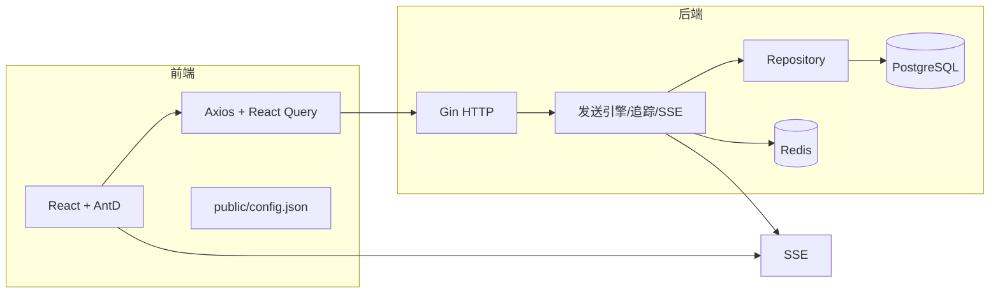

# 邮件批量发送服务平台（中文）

> 版本：v0.1.0  ·  许可证：MIT  ·  作者：团队协作

> 英文版主文档请见 `README.md`

## 概述
- 基于 Golang（后端）与 React（前端）的批量邮件发送平台，支持多邮箱配置、并发发送、风控策略、任务管理、实时监控（SSE）与邮件追踪（像素与链接）。
- 后端：Gin + GORM + Viper；数据库：PostgreSQL；可选：Redis。
- 前端：React 18 + TypeScript + Vite；UI：Ant Design；图表：Chart.js。

## 安装与部署
- 系统要求：Node.js ≥ 18、Golang ≥ 1.21、PostgreSQL ≥ 15、Redis ≥ 7（可选）、Python 3.12（可选）
- 依赖安装：前端 `npm install`；后端 `go mod tidy`
- 配置：`backend/config/config.yaml` 支持 `EMAIL_*` 环境覆盖；前端 `public/config.json` 运行时加载
- 启动命令：后端 `go run ./cmd/server`；前端 `npm run dev`
- Docker：完整版使用 `docker-compose.yml`；精简版（已有 DB/Redis）使用 `docker-compose.app.yml`

## API 示例
- 健康检查：`GET /health`
- 邮箱配置：`POST /email-configs`
- 任务：`POST /tasks`
- SSE 订阅：`GET /sse/tasks/:id`

## 贡献与规范
- 遵循 SOLID；中文注释；结构化日志；安全合规

## 版本
- v0.1.0：初始版本
