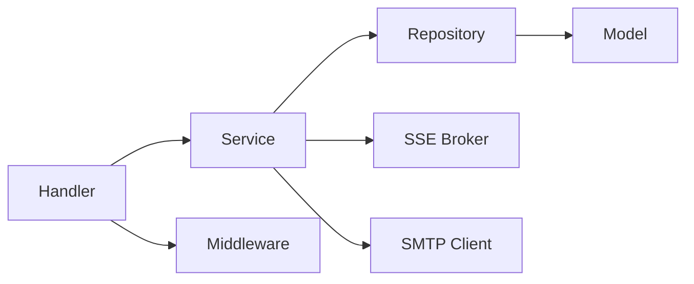
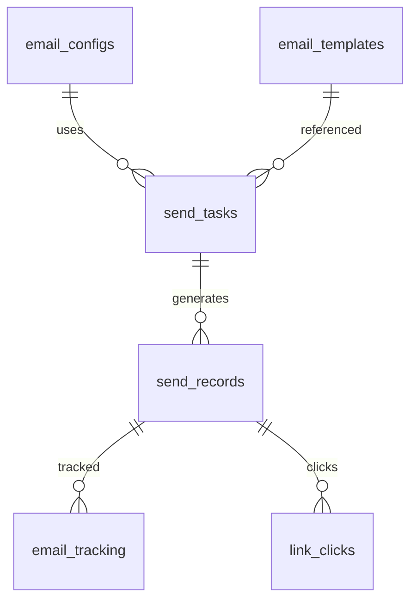
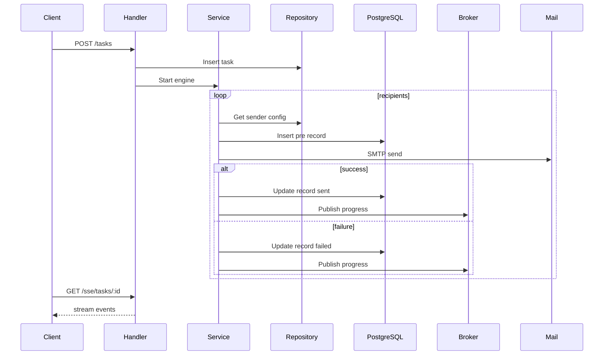

# 后端服务说明（Golang / Gin）

## 架构概述
- 分层设计：`handler`（HTTP 接口） → `service`（业务逻辑） → `repository`（数据访问） → `model`（数据模型）
- 横向能力：`middleware`（日志/恢复）与 `pkg`（email/sse/crypto/db 等通用模块）

## 技术栈
- 框架：Gin（HTTP）、GORM（ORM）、Viper（配置）
- 数据库：PostgreSQL（推荐 ≥15）
- 其他：Redis（可选缓存/队列）、SSE（服务端事件）、Cron（可扩展定时）

## 数据库设计
- 表结构：
  - `email_configs`：邮箱配置（SMTP、每日上限、启用）
  - `email_templates`：模板（名称、主题、内容、富文本、追踪开关）
  - `send_tasks`：任务（名称、发件账号集合、收件人集合、模板、定时、状态）
  - `send_records`：记录（任务ID、发件/收件、时间、状态、错误、重试次数）
  - `email_tracking`：追踪（记录ID、打开次数与时间、阅读时长）
  - `link_clicks`：点击（记录ID、URL、点击时间）

## API 规范（REST）
- 健康检查：`GET /health`
- 邮箱配置：`GET/POST/PUT/DELETE /email-configs`、`GET /email-configs/:id`
- 模板：`GET/POST/PUT/DELETE /templates`
- 任务：`POST /tasks`、`GET /tasks/:id/status`
- 监控：`GET /stats/send`、`GET /sse/tasks/:id`
- 追踪：`GET /t/open/:rid.png`、`GET /t/click?rid=&url=`
- 重试：`POST /records/:id/retry`
- 数据库诊断：`GET /db/ping`、`GET /db/perf`、`POST /db/transaction`、`GET /db/concurrency`

## 核心流程

## 中间件与配置
- 日志：结构化日志，记录路径、方法、状态码与耗时（`internal/middleware/logger.go`）
- 配置：`backend/config/config.yaml` + 环境变量 `EMAIL_*` 覆盖（见 `internal/config/config.go` 与 `internal/pkg/db/db.go`）

## 测试方案
- 单元测试：数据库连接与性能/事务/并发（`internal/pkg/db/db_test.go`）
- 集成测试：建议使用 Postman/Curl 组合验证 API + SSE + 追踪
- 报告输出：`backend/test-reports/db_report.json`

## 性能优化建议
- 连接池：合理设置 `max_open`、`max_idle`、生命周期与空闲时间
- 索引优化：为任务ID、状态、时间等查询高频字段建立索引
- 并发度：根据账号与频控策略调整 `workerSize`
- 熔断与重试：根据服务商限制调优阈值与冷却时间

## 部署注意事项
- Docker：编写后端 Dockerfile 与 Compose，并设置 `EMAIL_*` 环境变量
- K8s：使用 ConfigMap/Secret 管理配置与密钥；HPA 基于 CPU/内存或自定义指标
- 日志与指标：接入 ELK/Prometheus 以增强可观测性

## 版本日志
- v0.1.0：初始版本交付，完成核心功能与配置抽离
